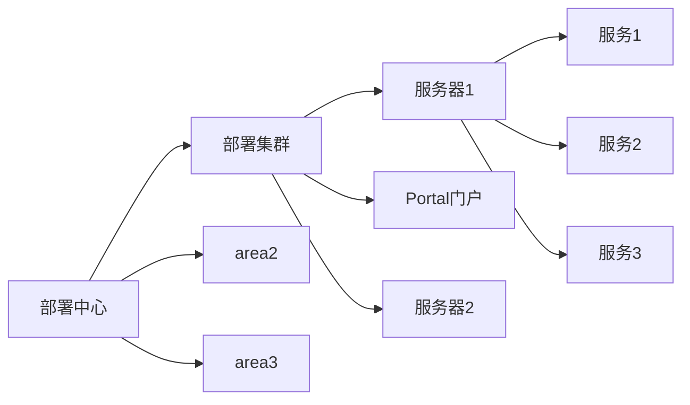

# magicmind microservice management 微服务架构

> 文档写作：采用 markdown 格式，所有流程图采用 draw.io 进行绘制

#目录

<!-- @import "[TOC]" {cmd="toc" depthFrom=2 depthTo=6 orderedList=false} -->

<!-- code_chunk_output -->

- [目标](#目标)
- [总体架构](#总体架构)
- [发布仓库](#发布仓库)
- [部署中心](#部署中心)
  _ [Portal 门户](#portal-门户)
  _ [服务器管理](#服务器管理)

<!-- /code_chunk_output -->

## 目标

MMM 微服务管理平台，面向以 Javascript / Typescript 全栈开发者的微服务平台体系。期望达成面向开发者友好的微服务平台，实现低成本的运营开发服务。

## 总体架构

## 发布仓库

- 发布仓库位于云端 OSS，开发者在完成组件开发后，发布产品包到发布仓库中。
- 部署中心访问发布仓库的内容和版本信息，通过手动方式进行新服务集群的部署或者版本升级。
- 发布仓库包含每次发布的版本以及发布日志等

## 部署中心

部署管理中心管理多个部署区域， 每个部署区域由一个 Portal 门户入口+一个或多个服务器构成部署集群。

### Portal 门户

门户部署实体可以是一个 HTTP 静态服务或者 OSS 云服务，部署中心根据部署策略，发布门户包以及相关组件包到门户

- 采用 OSS API 进行上传
- 采用 ssh 方式上传更新 HTTP 静态服务内容

### 服务器管理

- envoy 作为服务代理
- docker 模式进行部署，自动映射端口
- 自动负载和熔断
- envoy 负责进行接口权限验证，处理安全 token
